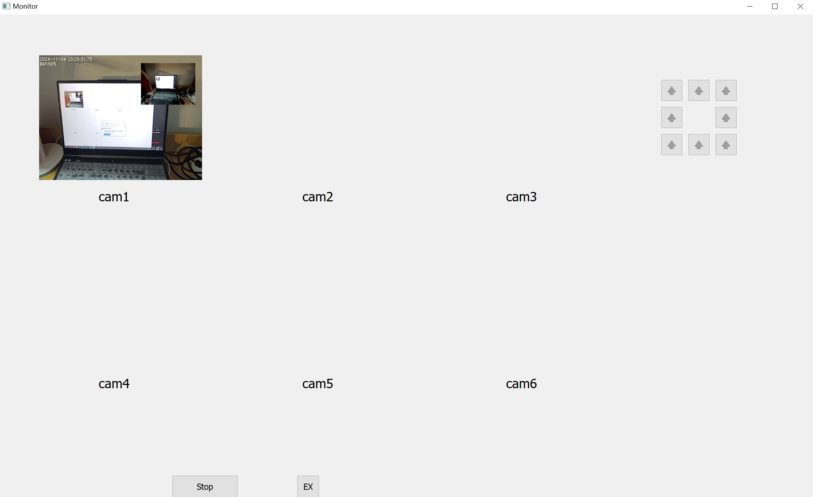

# hkvision-project
### DONE:
+ v1: use `multiprocessing` for communication between Qt-page and camera

+ v2: add ctrl unit supporting basic PTZ control: 8 directions rotation(can)

### UNDER CONSTRUCTION

+ v3: stablize input video stream using `threading`, make it really 'real time', now it running with delay

### PREVIEW 
+ v2:  