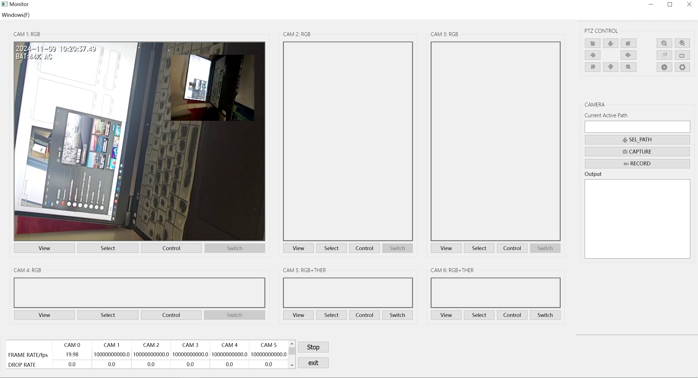
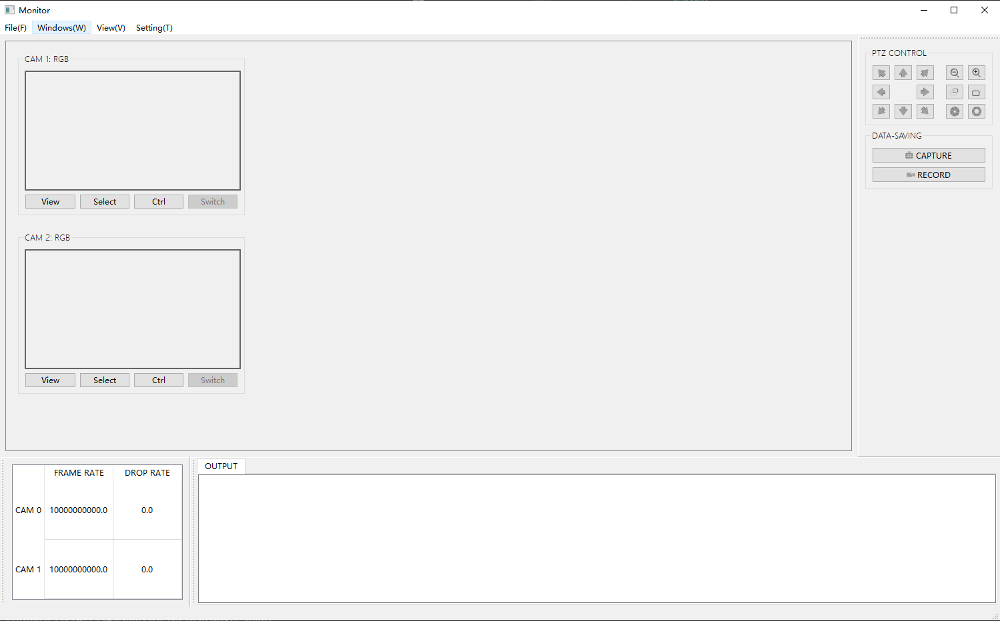
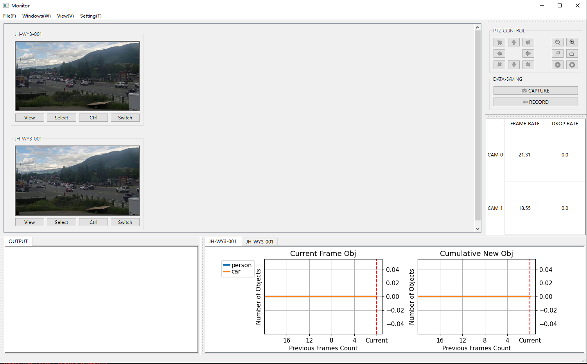
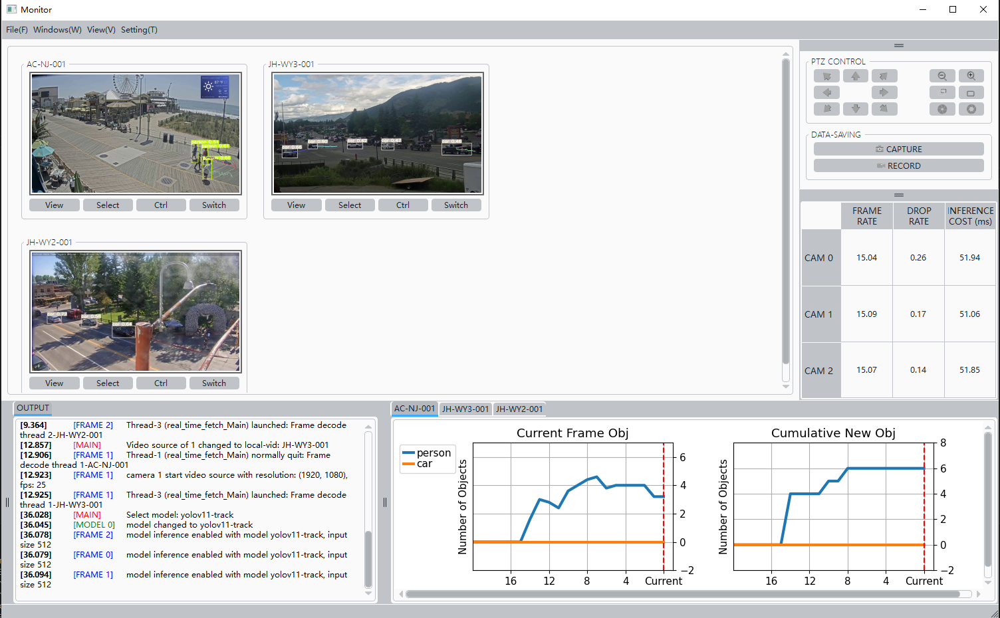

# EI6705-037-M01-DISTCAM

## Introduction
This project is a distributed camera system for the course project of EI6705-037-M01. The system is composed of several cameras and a central server. The cameras are used to capture the video stream and send it to the server. The server is used to process the video stream and control the cameras. Moreover, the system integrates AI models to detect and classify objects in the video stream, providing real-time video analysis.


## Function Display
+ change video source

  

+ smooth canvas scaling

  

+ simulating PTZ control for one frame window

  

+ activate yolov3 inference

  

+ activate yolov11 inference, enabling tracking, setting restriction areas

  


## SETUP
### 1. build enviroment
+ create a new virtual environment through `conda`
  ```bash
  conda create -n distcam python=3.10.9
  conda activate distcam
  ```
+ install necessary packages
  ```
  pip install -r requirements.txt
  ```
+ install `pytorch`
  ```
  pip install torch==1.12.1+cu116 torchvision==0.13.1+cu116 torchaudio==0.12.1 --extra-index-url https://download.pytorch.org/whl/cu116
  ```

### 2. video source config
video source file located at `configs/video_source_pool.json`, the hierarchy of the file is as follows:
+ `choices`: a list of video source, each element is a list of 2 sub-elements, the first one is the type of video source, the second one is the name of the video source. The i-th camera will use the i-th video source in the list. Here is a case of 2 cameras:
  ```json
  "choices": [
    ["local-vid", "JH-WY3-001"],
    ["local-vid", "JH-WY3-001"]
  ],
  ```
+ `sources`: a dictionary of 3 types of video sources, each key is video type and value is a list of serveral video sources of this type. After the programme launchs, it will read specific video source according to the `choices`.
  + `local-vid`: a list of local video files, includes name (`NICKNAME`) and filename (`PATH`), for example:
    ```json
    "local-vid": [
            {
                "NICKNAME": "JH-WY3-001",
                "PATH": "Jackson-Hole-WY3@06-27_07-05-02.mp4"
            }
        ]
    ```
  + `ip-cam`: a list of mobile device rtsp stream, mainly for phone, includes name (`NICKNAME`), ip address (`IP`), port (`PORT`), account name (`NAME`) and password (`PASSWD`) and channel (`CHANNEL`), for example:
    ```json
    "ip-cam": [
            {
                "NICKNAME": "XiaoMi-14-Pro",
                "NAME": "admin",
                "PASSWD": "1234",
                "IP": "192.168.31.209",
                "PORT": "8554",
                "CHANNEL": "1"
            }
        ]
    ```
  + `hikvision`: for hikvision network cameras, similar as `ip-cam`

### 3. programme run
+ switch to root directory of this project and use `run.py`
  ```bash
  python run.py --num_cam 2
  ```

## Version Iterations:
### v1: 
+ use `multiprocessing` for communication between Qt-page and camera
+ build basic layout, including view panel (left) and control panel (right)
+ basic control button: start streaming and exit
+ support connecting to IP-CAMERA on mobile through `rtsp`
+ add ctrl unit supporting basic PTZ control: 8 directions rotation(can)
    

### v2: 
+ stablize input video stream using `threading`, make it really 'real time', now it running with delay
+ add `data panel` to show realtime frame rate and drop rate
+ add option of taking videos or picture of one or more cameras simultaneously, by using button `select` to select cameras first then using `capture` or `record`
+ add PTZ control for `ZOOM_IN/OUT`, `FOCUS_NEAR/FAR`, `IRIS_OPEN/CLOSE` and updating their icons
+ add path select unit for file saving through `SEL_PATH`, and the path will be shown in textbrowser above it
+ redirect output prompt from terminal to `Output` text browser in Qt_ui page
+ add button `view` in order to check specfic camera in full screen mode(in view panel zone), subsequent click will recover to status of multi-camera view
   


### v3: 
+ re-construct repo architecture, using `queue` in `multiprocessing` and `threading`, replacing `shareMemory` and supporting more flexible scaleing and maintainability
+ add `set_save_prefer`, where users can assign the interest area in the image, and the area will be saved in the video or picture
+ add `model_inference` in menu bar, where users can select a model and run inference on the selected camera
+ other improvements: scale the layout, show/hide some tool bars.
   

### v4:
+ add a new tool bar that showing realtime-detection result of `yolov3` and `yolov11`
+ remove redundant `sel_path` button
+ support set hyper parameters for `yolov3` and `yolov11` in `model_selection` window
+ save all hyper parameters in some neat config files.
+ support smooth window scaling when mainwindow size changed
   

### v5:
+ use `qdarkstyle` to make the UI more beautiful
+ support showing log info in `Output` text browser, while saving as `.log` file
+ add `inference cost` stats in realtime data panel
+ fix bugs for model selection function
+ support set restriction area by dragging anchers in `model_selection` window
   