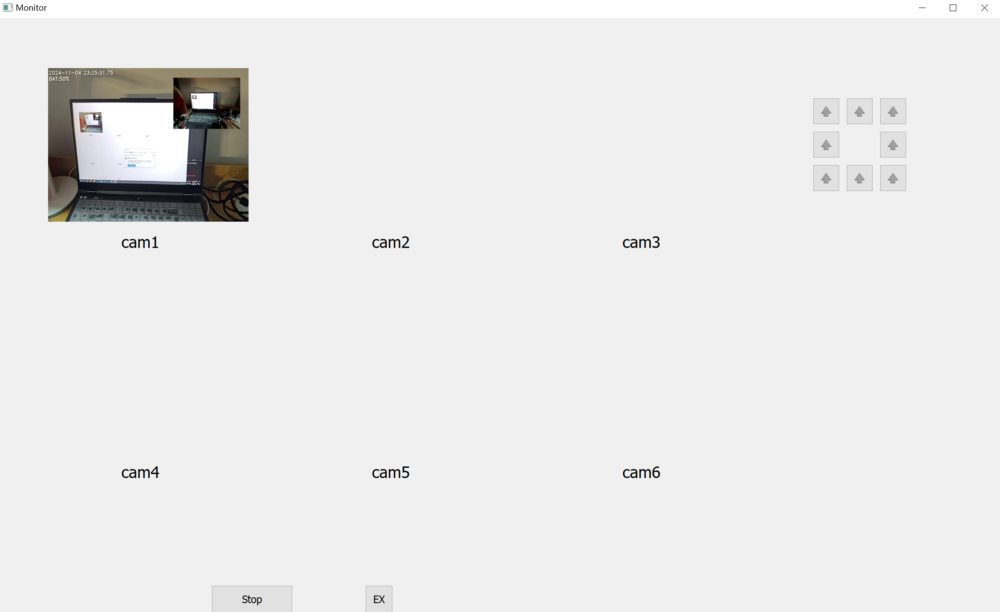

# EI6705-037-M01-DISTCAM

## SETUP
### 1. build enviroment
+ create a new virtual environment through `conda`
  ```bash
  conda create -n distcam python=3.10.9
  conda activate distcam
  ```
+ install necessary packages
  ```
  pip install -r requirements.txt
  ```
+ install `pytorch`
  ```
  pip install torch==1.12.1+cu116 torchvision==0.13.1+cu116 torchaudio==0.12.1 --extra-index-url https://download.pytorch.org/whl/cu116
  ```

### 2. video source config
video source file located at `configs/video_source_pool.json`, the hierarchy of the file is as follows:
+ `choices`: a list of video source, each element is a list of 2 sub-elements, the first one is the type of video source, the second one is the name of the video source. The i-th camera will use the i-th video source in the list. Here is a case of 2 cameras:
  ```json
  "choices": [
    ["local-vid", "JH-WY3-001"],
    ["local-vid", "JH-WY3-001"]
  ],
  ```
+ `sources`: a dictionary of 3 types of video sources, each key is video type and value is a list of serveral video sources of this type. After the programme launchs, it will read specific video source according to the `choices`.
  + `local-vid`: a list of local video files, includes name (`NICKNAME`) and filename (`PATH`), for example:
    ```json
    "local-vid": [
            {
                "NICKNAME": "JH-WY3-001",
                "PATH": "Jackson-Hole-WY3@06-27_07-05-02.mp4"
            }
        ]
    ```
  + `ip-cam`: a list of mobile device rtsp stream, mainly for phone, includes name (`NICKNAME`), ip address (`IP`), port (`PORT`), account name (`NAME`) and password (`PASSWD`) and channel (`CHANNEL`), for example:
    ```json
    "ip-cam": [
            {
                "NICKNAME": "XiaoMi-14-Pro",
                "NAME": "admin",
                "PASSWD": "1234",
                "IP": "192.168.31.209",
                "PORT": "8554",
                "CHANNEL": "1"
            }
        ]
    ```
  + `hikvision`: for hikvision network cameras, similar as `ip-cam`

### 3. programme run
+ switch to root directory of this project and use `run.py`
  ```bash
  python run.py --num_cam 2
  ```

## DONE:
### v1: 
+ use `multiprocessing` for communication between Qt-page and camera

### v2: 
+ add ctrl unit supporting basic PTZ control: 8 directions rotation(can)


### v3: 
+ stablize input video stream using `threading`, make it really 'real time', now it running with delay
+ add `data panel` to show realtime frame rate and drop rate
+ add option of taking videos or picture of one or more cameras simultaneously, by using button `select` to select cameras first then using `capture` or `record`
+ add PTZ control for `ZOOM_IN/OUT`, `FOCUS_NEAR/FAR`, `IRIS_OPEN/CLOSE` and updating their icons
+ add path select unit for file saving through `SEL_PATH`, and the path will be shown in textbrowser above it
+ redirect output prompt from terminal to `Output` text browser in Qt_ui page
+ add button `view` in order to check specfic camera in full screen mode(in view panel zone), subsequent click will recover to status of multi-camera view

## UNDER CONSTRUCTION
+ other necessary data in panel
+ other control such as adjust resolution
+ set max frame window size

## PREVIEW 
+ v2:  
+ v3:  

## FUNC
<video width="816" height="438" controls>
  <source src="doc/figs/function/full_view.mp4" type="video/mp4">
  Your browser does not support the video tag.
</video>
